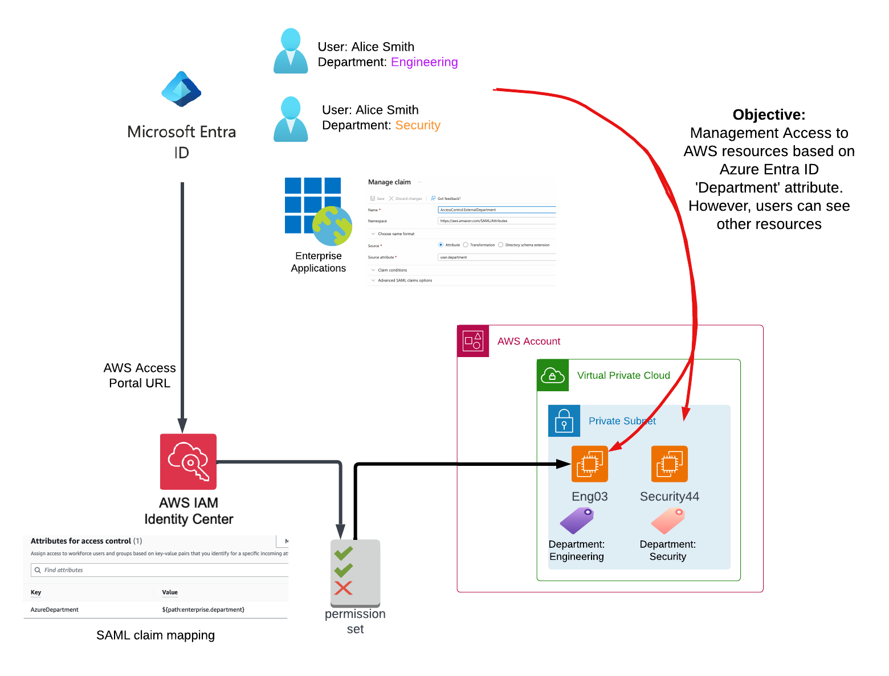

# Overview  

Please see blog site https://devbuildit.com/2024/02/04/abac-for-aws-resource-access-part-2/ for detailed explaination of this repo contents.

# Installation  
This repo (and associated blog) will modify an existing AWS Identity Center instance and set up some ABAC testing resources.

Solution overview:

## Requirements:
- Terraform CLI installed with access to your target AWS account
- AWS identity center & Azure Entra setup as detailed on part 1 (https://devbuildit.com/2024/01/14/abac-for-aws-resource-access-part-1/)
- Azure Entra ID Enterprise Application claim updated to expose user's Department attribrute

## AWS Deployment

- Clone repo into folder
- change into terraform subfolder
- Run command 'Terraform init'
- Run command 'Terraform plan' 
- Run command 'Terraform apply' and type 'yes' to confirm deployment

## Tidy up

Removed SSO Permission set provisioning and assignments, then run terraform destroy.

- Disassocate SSO with assigned users
- unprovision SSO from account
- Run command Terraform destroy

